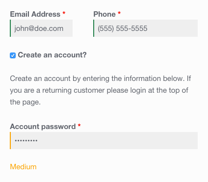

<!-- DO NOT EDIT THIS FILE; it is auto-generated from readme.txt -->
# WooCommerce Password Strength Meter

Display a password strength meter when customers register during checkout.

**Contributors:** [fjarrett](https://profiles.wordpress.org/fjarrett)  
**Tags:** [account](https://wordpress.org/plugins/tags/account), [checkout](https://wordpress.org/plugins/tags/checkout), [ecommerce](https://wordpress.org/plugins/tags/ecommerce), [passwords](https://wordpress.org/plugins/tags/passwords), [security](https://wordpress.org/plugins/tags/security), [shop](https://wordpress.org/plugins/tags/shop), [shopping](https://wordpress.org/plugins/tags/shopping), [store](https://wordpress.org/plugins/tags/store), [woocommerce](https://wordpress.org/plugins/tags/woocommerce)  
**Requires at least:** 4.0  
**Tested up to:** 4.2  
**Stable tag:** 1.0.0  
**License:** [GPLv3](https://www.gnu.org/licenses/gpl-3.0.html)  
**WC requires at least:** 2.1.0  
**WC tested up to:** 2.3.8  

## Description ##

The first line of defense for securing any WooCommerce store is to ensure that customers are using strong passwords.

This plugin encourages the use of strong passwords by showing customers a live strength meter that measures the complexity of their password during account creation on the checkout page.

## Frequently Asked Questions ##

### I have a question? ###
Here is the answer.

## Screenshots ##

### Customers can see their password's strength when registering for an account during checkout.

## Changelog ##

### 1.0.0 - May 21, 2015 ###
* Initial release

Props [fjarrett](https://github.com/fjarrett)

